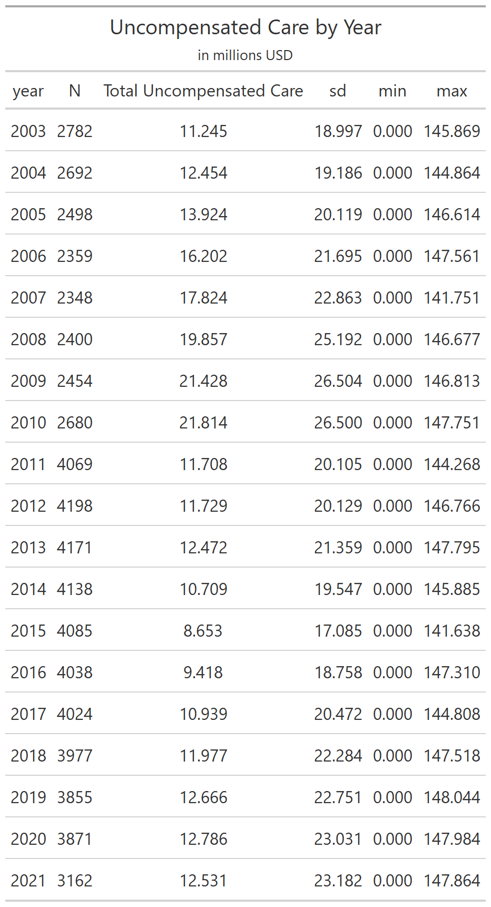
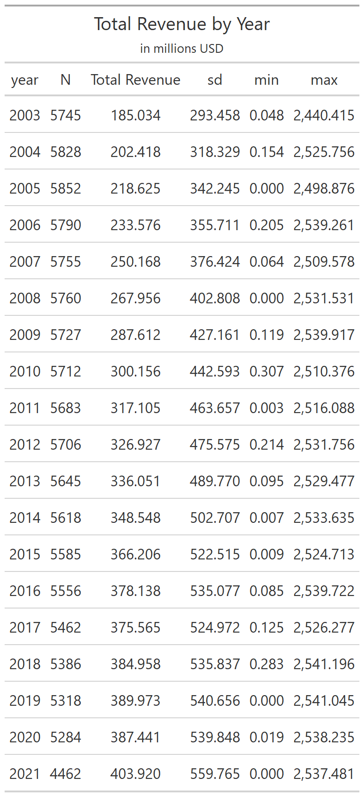
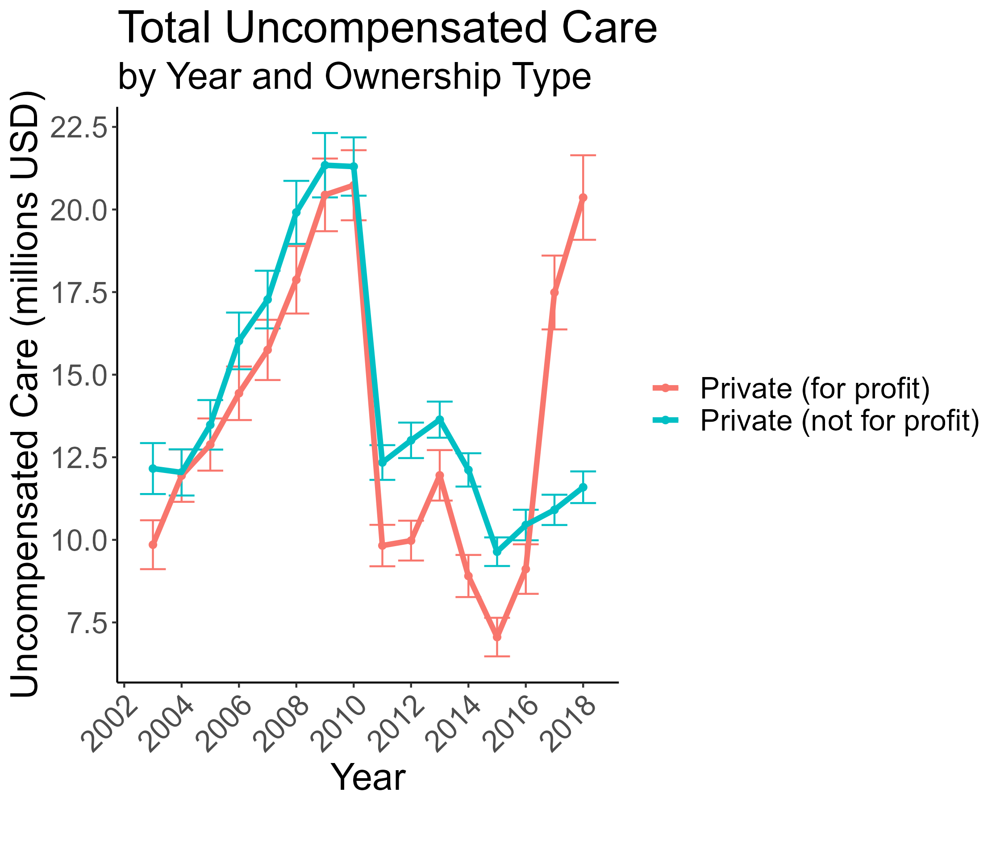
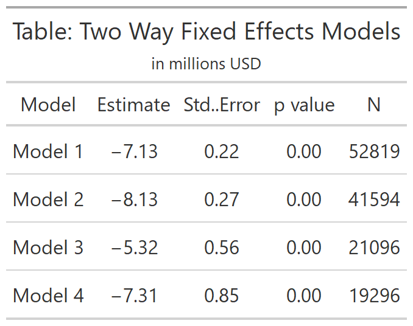
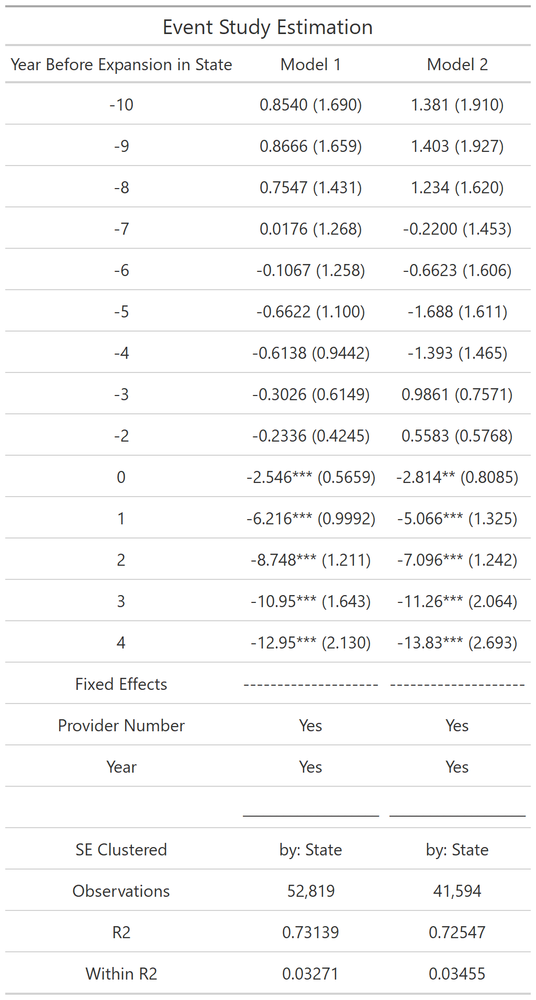
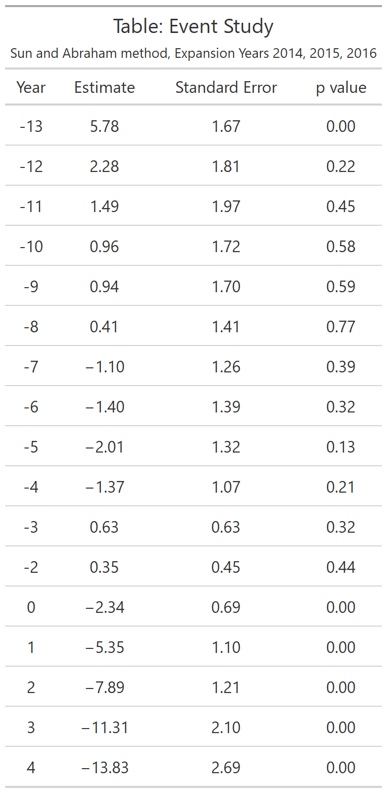
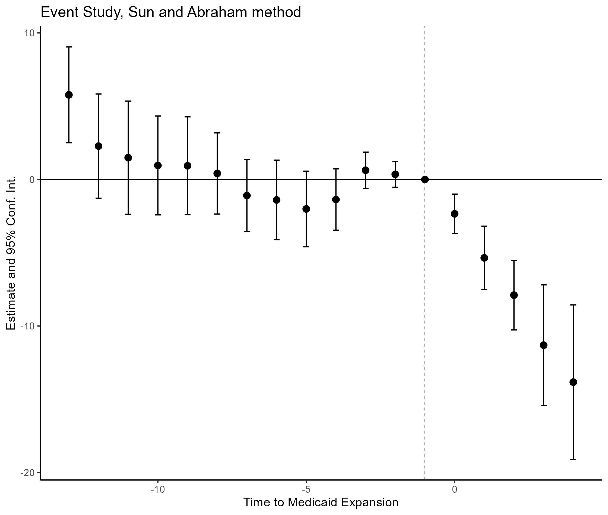
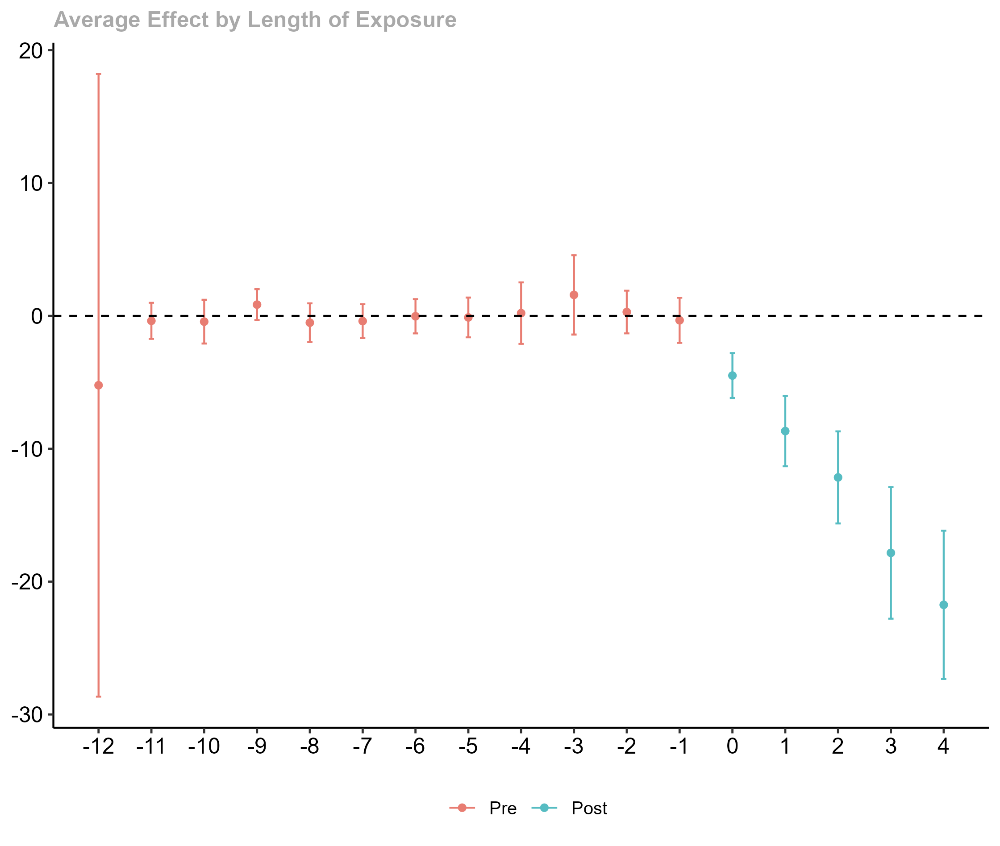
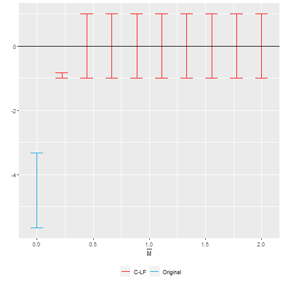

```{r setup, echo =FALSE}

# note, this document has been created in conjunction with Assign_1_FINAL.R, which creates the plots to be displayed in this R markdown file


```

## 1.	Provide and discuss a table of simple summary statistics showing the mean, standard deviation, min, and max of hospital total revenues and uncompensated care over time. 

We do not have reliable data from 1997-2002 for uncompensated care, that data seems to not be reported. As such, I will focus my analysis on the years 2003-2021, given the overarching point of this assignment is regarding uncompensated care. As we can see below, total revenue increases steadily over time, whereas uncompensated care increases until 2010, and then sharply decreases in 2011 and remains somewhat stable from 2011 until 2011. 

.  
.  


## 2. Create a figure showing the mean hospital uncompensated care from 2003 to 2019. Show this trend separately by hospital ownership type (private not for profit and private for profit).

.  


## 3.	Using a simple DD identification strategy, estimate the effect of Medicaid expansion on hospital uncompensated care using a traditional two-way fixed effects (TWFE) estimation. 

.  

In the above table, Model 1 is the full sample, Model 2 limits to 2014, model 3 to 2015, and model 4 to 2016. The estimates are roughly the same, showing that there is a significant decrease in uncompensated care for hospitals in states that expanded. However, the standard errors increase from Model 1 to Model 4, which could be a function of the decreasing number of observations from Model 1 to 4. 


## 4. Estimate an “event study” version of the specification in part 3. 

.  

Note that we can see similar trends prior to the cutoff, and decreasing values of our $\beta$ coefficient after the cutoff. 


## 5.	Sun and Abraham (SA) show that the coefficients in Equation (2) can be written as a non-convex average of all other group-time specific average treatment effects; provide an alternative event study using the CS estimator. 

.

## 6.	Present an event study graph based on the results in part 5. 

. 

## 7. Callaway and Sant’Anna (CS) offer a non-parametric solution that effectively calculates a set of group-time specific differences. 


We will aggregate the group-time effects into a single event study plot, but averaging the average treatment effects at different lengths of exposure to the treatment. 

. 

## 8. Using the HonestDiD package in R or Stata, present a sensitivity plot of your CS ATT estimates.  

Note that in the above graph, there does seem to be a clear inflection at year -1. Nonetheless, we will do a sensitivity analysis using Rambachan and Roth (2021) for violation of parallel trends.  

. 


## 9.	Discuss your findings and compare estimates from different estimators (e.g., are your results sensitive to different specifications or estimators? Are your results sensitive to violation of parallel trends assumptions?).   

As we can see above, the different estimators actually give very similar results. Even when choosing different years to evaluate, we continue to see that Medicaid expansion is clearly associated with decreases in uncompensated care, though, as expected, standard errors increase with fewer observations. Surprisingly, the RR specification seems to show a violation of parallel trends, though given the results prior, I’m concerned that is a mistake in my implementation of RR as opposed to a true result (though in several attempts to de-bug question 8, I was unsuccessful). 

## 10.	Reflect on this assignment. What did you find most challenging? What did you find most surprising?  

I found the initial part, the data wrangling, to be most frustrating. I was not particularly surprised by this, as in other projects with large, public datasets I have found this aspect to be very difficult and time-consuming. I think that’s an under-appreciated aspect in working with these datasets, is the time and care needed to correctly unpack the data. I was pleasantly surprised at how easy it was to implement Callaway and Sant’Anna and Abraham and Sun; the R packages are very convenient and easy to use (as opposed to RR, at least in my experience). If I were an econometrician, that would be a key takeaway from this assignment; that if I want my estimator to be widely used in practice, it is important to have easy-to-use, well-documented support for the actual implementation. Finally, I was quite surprised how quickly uncompensated care drops off at time = 0. I would have expected a several year delay, as oftentimes it takes several years for a policy that is passed to come into actual implementation. But the event studies above show a quick and clear reduction in uncompensated care. Finally, I found it quite difficult to convert everything into R-markdown, but perhaps this has laid the groundwork for future work, because the final product is quite nice. 

