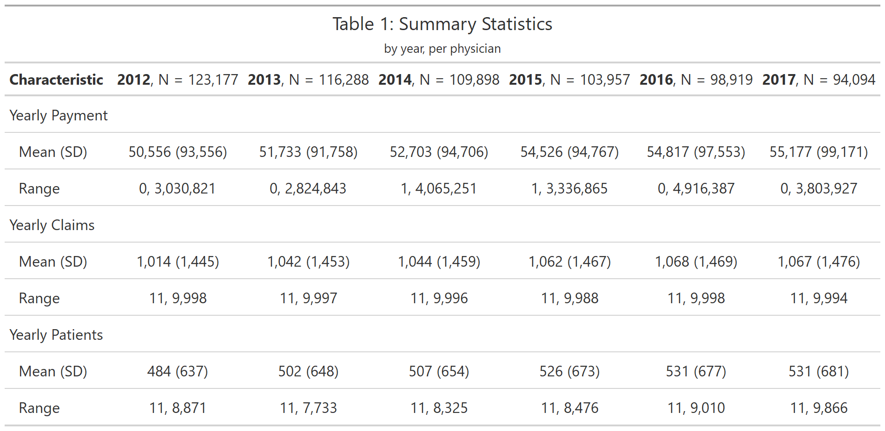
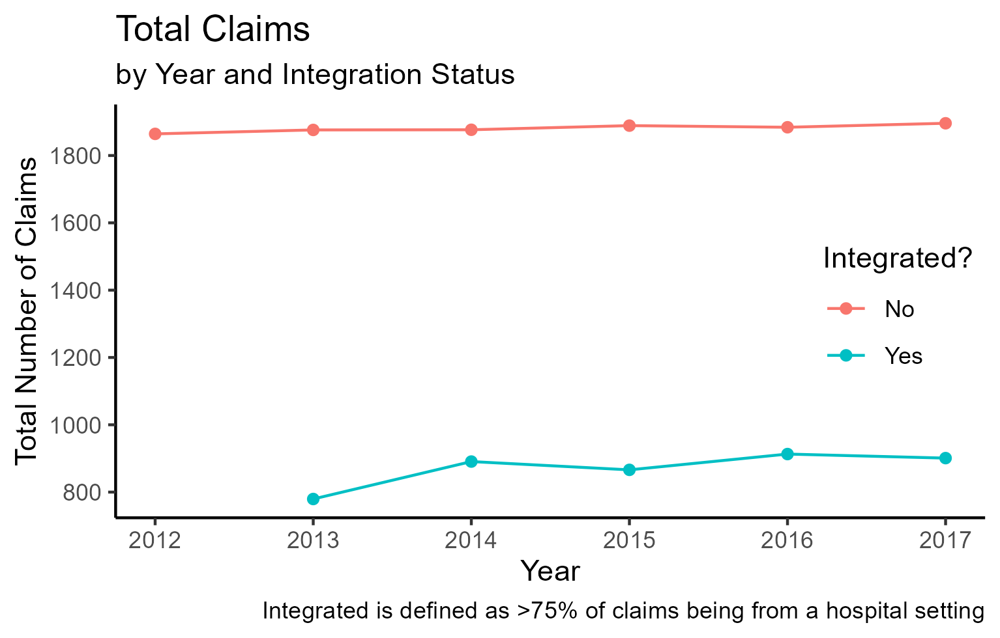
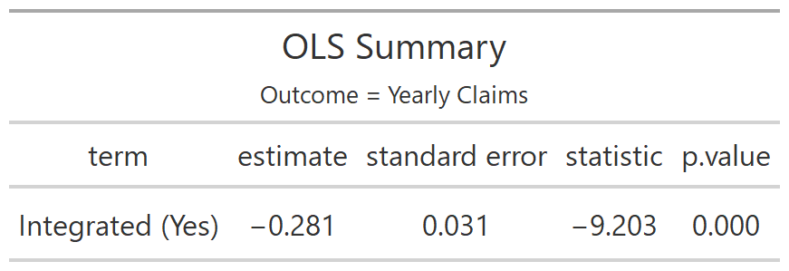
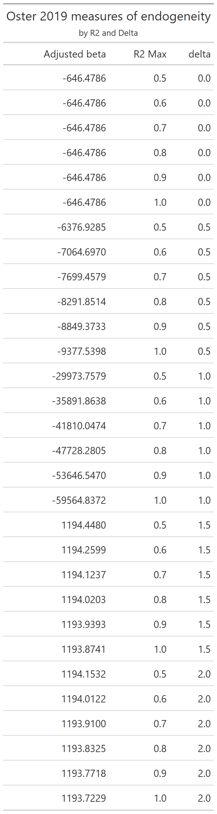
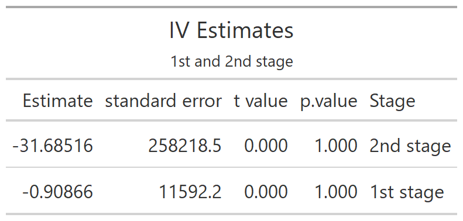
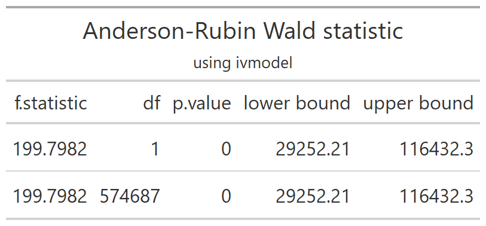
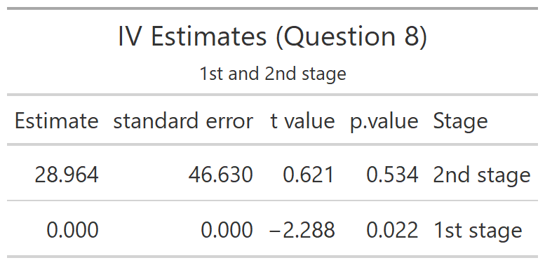

```{r setup, echo =FALSE}

# note, this document has been created in conjunction with Assign_2_FINAL.R, which creates the plots to be displayed in this R markdown file, and Assign2_create_df_FINAL.R, which creates the databases needed for this assignment

```


## 1.	Provide and discuss a table of simple summary statistics showing the mean, standard deviation, min, and max of total physician-level Medicare spending, claims, and patients.

.            

As we can see in Table 1, there is a very wide range of physician claims and payments. In fact, the range would have been even wider, but I deleted outliers, at it seems infeasible for an individual physician to see more than 10,000 patients per year (even 10,000 is quite unrealistic, but I had to cap somewhere and chose a more liberal estimate). 


## 2. Using this 75% threshold, plot the mean of total physician-level claims for integrated versus non-integrated physicians over time.


. 


## 3. Estimate the relationship between integration on (log) total physician claims using OLS. 

I initially tried to include Zip code as a time varying effect, but I was unable to surprisingly due to memory issues (I received an error that the object of 66 gigabytes was too large for my computer). Perhaps there is a more efficient way to do this, but based on what I found, it seems like feols is actually quite efficient. 

But, as is shows in the table below, being integrated is significant associated with fewer yearly claims (which is surprising to me, I would have thought that being integrated = higher amount billed = more billing/claims). 

. 


## 4. How much should we be “worried” about endogeneity here?

As we can see below, the adjusted beta varies significantly with different input paramaters. As such, we should be quite worried about endogeneity.  

. 


## 5. Construct the change in Medicare payments achievable for an integrated versus non-integrated physician practice due to the 2010 update to the physician fee schedule.  

As shown below, there is essentially no correlation between the instrument and the endogenous variable, or the instrument and the outcome variable. Given this is a homework assignment for a reason, I assume there is something incorrect with my coding. However, I am fairly confident that I have done the 2SLS correctly, so I'm thinking perhaps the way I created the instrument is awry. Alas. 

. 


## 6. Assess the “need” for IV by implementing a Durbin-Wu-Hausman test with an augmented regression.

My $\kappa$ estimate = -363.002, with p<0.0001. Thus here, we reject the null hypothesis, which in this case, means our $\beta_1$ is inconsistent and therefore there is significant endogeneity. So we do 'need' IV, or some other way of overcoming the endogeneity of our regressors. 


## 7. Now let’s pay attention to potential issues of weak instruments.  

Quite surprisingly, the estimates are very different using this method, as compared to the method in Equation (2). 
I went back and double checked my work from before, and cannot figure out why there is such a large difference. 
Further, for my 2SLS results, I do not even need to inflate the standard errors anymore than they are already
quite inflated. 

. 


## 8. Implement the BH re-centering approach. 

See below for the estimated table using the BH recentering approach. 

. 


## 9. Discuss your findings and compare estimates from different estimators.

Overall, I was quite surprised that the IV model did not seem to hold. But, as discussed above, my concern is that I did not implement correctly the code that created the instrument, as opposed to incorrectly implementing the actual regression (which, in my mind, is more important for this assignment.) Though, it seems as if health services researchers agree with EconTwitter in that the general tone is very much opposed to instrumental variable analysis. 

## 10. Reflect on this assignment. What did you find most challenging? What did you find most surprising?

I actually learned quite a bit of new R coding for this assignment, which I will carry forward. For example, making new variables with for loops was new to me, as was randomly assigning a vector. So I really liked that aspect of the assignment. Otherwise, to be honest, while I understand the general theory of IV, the more advanced stuff is a bit over my head (which is OK for a simple health services researcher like me!). Lastly, R markdown went much better this time around - I like creating figures and running the actual code in a separate file, and then displaying/presenting with the R markdown file.   
