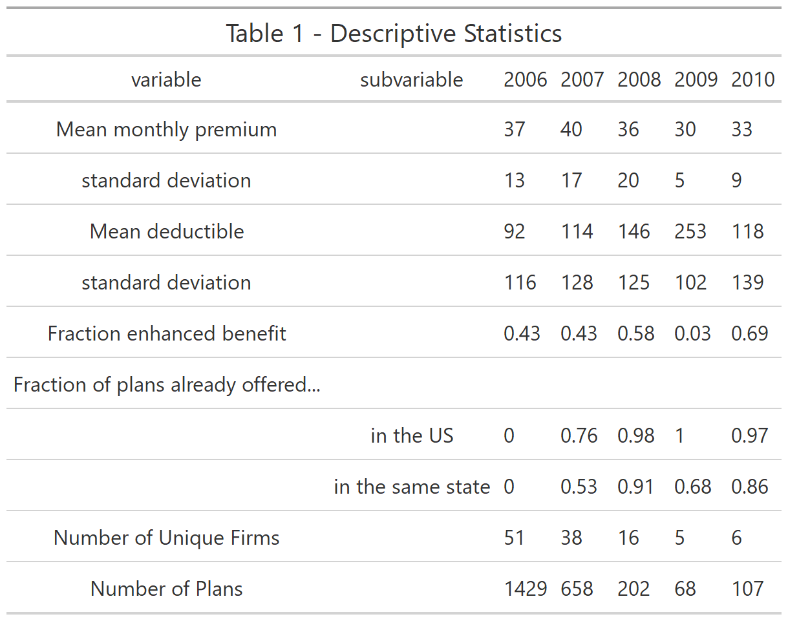
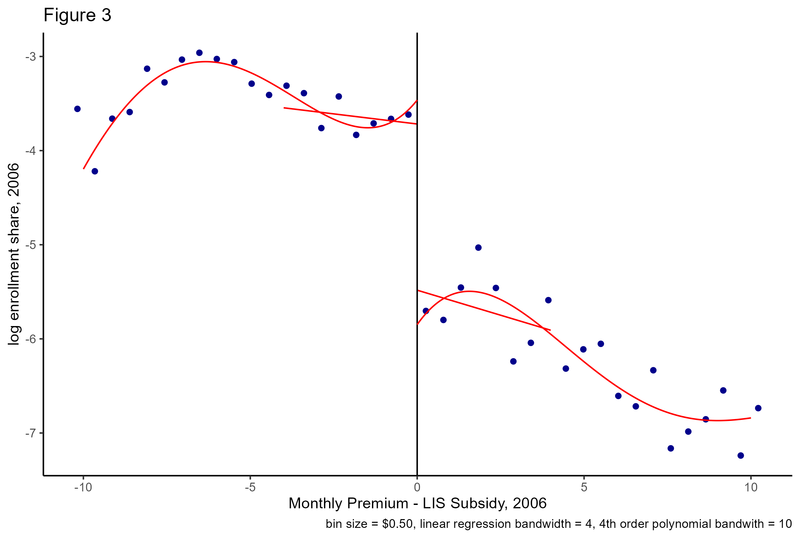
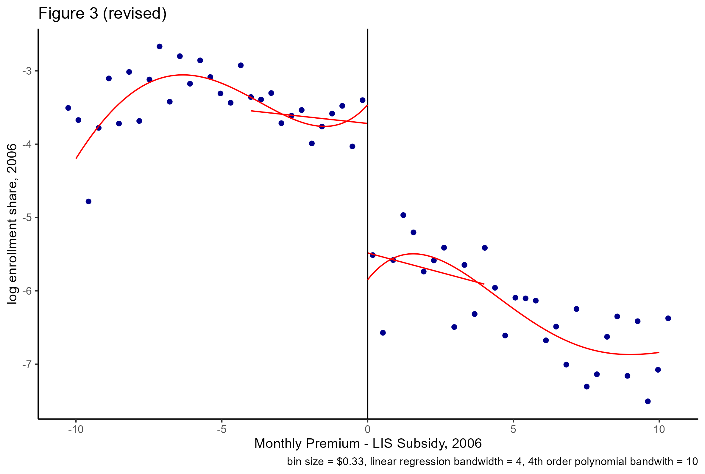
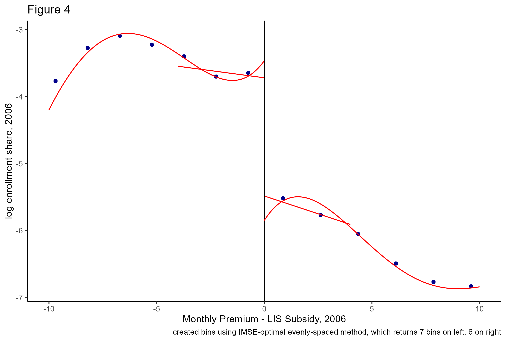
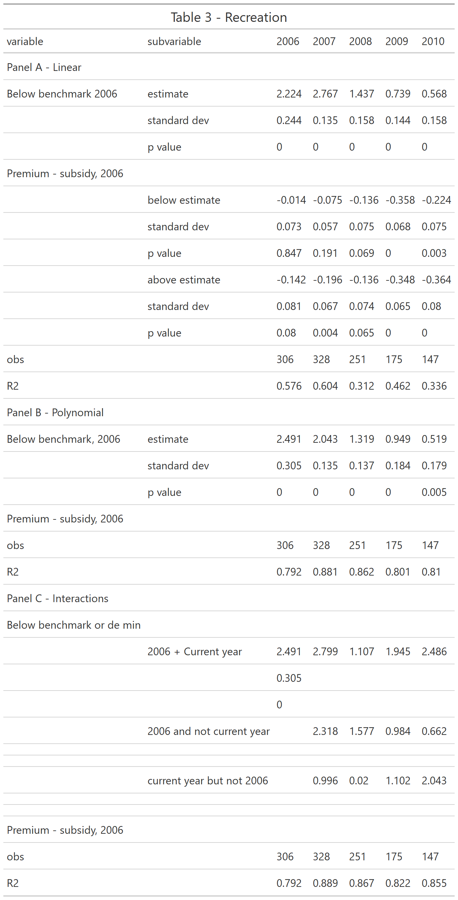
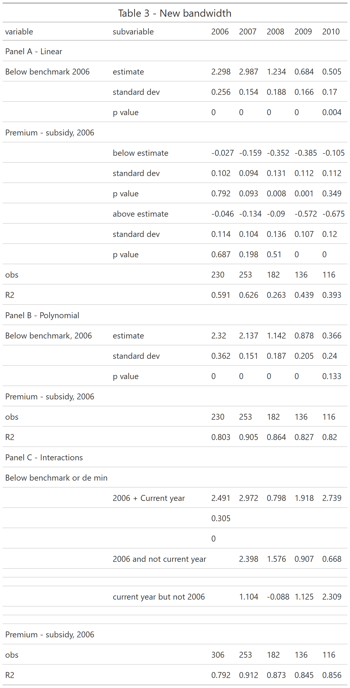
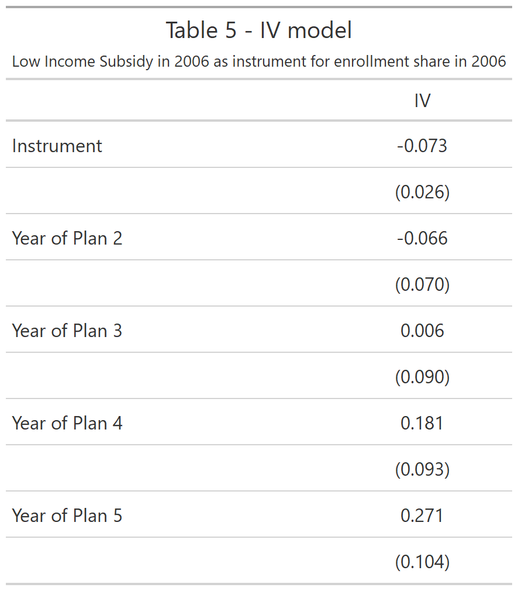

```{r setup, echo =FALSE}

# note, this document has been created in conjunction with Assign_2_FINAL.R, which creates the plots to be displayed in this R markdown file, and Assign2_create_df_FINAL.R, which creates the databases needed for this assignment

```


## 1.	Recreate the table of descriptive statistics (Table 1) from Ericson (2014).

.            


## 2. Recreate Figure 3 from Ericson (2014).


. 


## 3. Recreate Figure 3 from Ericson (2014). Discuss your results and compare them to your figure in Part 2. 

The two figures are actually quite similar, despite the differing number of partitions. 

. 


## 4. Use the rdrobust package in R (or Stata or Python) to find the optimal number of bins with an evenly-spaced binning strategy. Report this bin count and recreate your binned scatterplots from parts 2 and 3 based on the optimal bin number.

Below, I created bins using IMSE-optimal evenly-spaced method, which returns 7 bins on left, 6 on right. 

. 


## 5.  Provide the results from the manipulation tests described in Cattaneo, Jansson, and Ma (2018).  

Using the above test, we obtain a p value of 0.38, which suggests there is not manipulation around the threshold, which adds evidence to support the regression discontinuity design assumption. Per the paper, this should be expected, as the firms had to choose their premiums prior to the subsidy level announcement. However, this helps in confirming the assumption that firms couldn't manipulate near the RD cutpoint (which would have been theoretically possible, as perhaps firms could have had inside information on what the subsidies would be, and adjusted accordingly). 


## 6. Recreate Table 3 of Ericson (2014) using the same bandwidth of $4.00.

This table below was a doozy to re-create (though I feel like I came up with R code that was able to automatically update the table, which was nice, especially given the next question!). It looks like my column one mostly matches, but then I differ in my results in the subsequent columns. Even comparing my R code to his Stata code, I can't quite figure out what the issue is (though I'm not very familiar with Stata). We have different numbers of observations, which I find odd, because the bin-width inclusion criteria seems straight forward.

Also, of note, I had already created Table 3 by the time we were told to not include Panel C. So I wanted to keep it in, to reflect the work I'd put in!! 

.   

## 7. Re-estimate your RD results using the CE-optimal bandwidth (rdrobust will do this for you) and compare the bandwidth and RD estimates to that in Table 3 of Ericson (2014).  

Note from the package documentation, h specifies the main bandwidth, and b specifies the bias bandwidth. Thus, we obtain our bandwidth per the specification should be 3.05 and 3.05, and the table below displays those results. Again, these results are quite similar to the previous 2 tables. I can't really find a pattern, some of the estimates are a bit higher, others are a bit lower. My a priori guess would have been that the smaller the bandwidth, the higher the estimates in general, but that doesn't seem to be the case. 

.  


## 8. Now let’s extend the analysis in Section V of Ericson (2014) using IV. Use the presence of Part D low-income subsidy as an IV for market share to examine the effect of market share in 2006 on future premium changes.

.  

## 9. Discuss your findings and compare results from different binwidths and bandwidths. Compare your results in part 8 to the invest-then-harvest estimates from Table 4 in Ericson (2014).

As discussed above, the binwidths and bandwidths did not affect the estimates very much. I think this adds robustness to the model, because it could be problematic if the model and model's significance and findings were very dependent on the binwidth (especially binwidth) or bandwidth.  

The results from question 8 are similar to the results from Ericson Table 4, in that they show an increasing effect as the year of plan increases.  
 

## 10. Reflect on this assignment. What did you find most challenging? What did you find most surprising?

I really enjoyed this assignment overall - I think RD estimators, when applicable, are pretty straight-forward and much more understandable than IV, especially to an audience that's unfamiliar with causal inference (such as the audience for most medical literature). I plan to use RD in the future, so I found this exercise particularly helpful. I struggled a bit at first coming up with the plots (the most important part!), but once I got a handle on rdrobust package, it's actually pretty straight-forward. 

